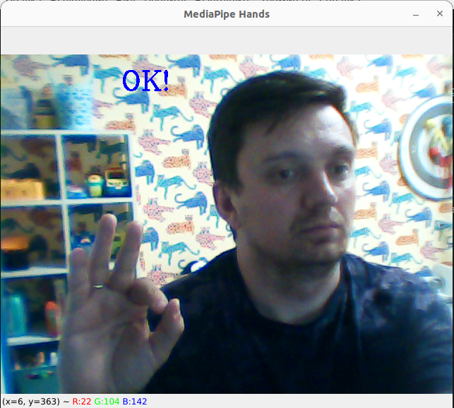
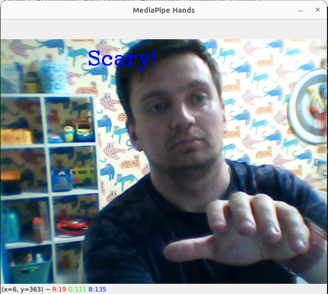

## Курсовой проект по теме "Распознавание лиц и эмоций".  
В данном курсовом проекте я разработал приложение, которое считывает  
изображение с веб-камеры и производит детектирование лица. При удачном  
обнаружении лица производится детектирование жеста пользователя. В  
зависимости от жеста, на экран выводится соответствующее сообщение.  
  

  
Скриншоты работы программы, реакция модели на известные жесты:  
 
  
 
  
 
  
   
При отсутствии лица в кадре модель перестаёт реагировать на жесты:  
 
  
 
   